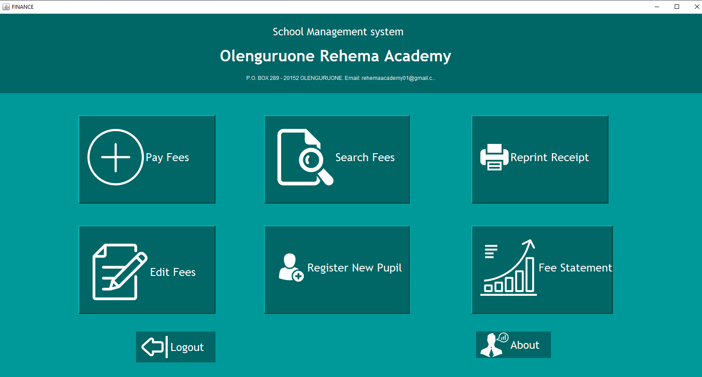
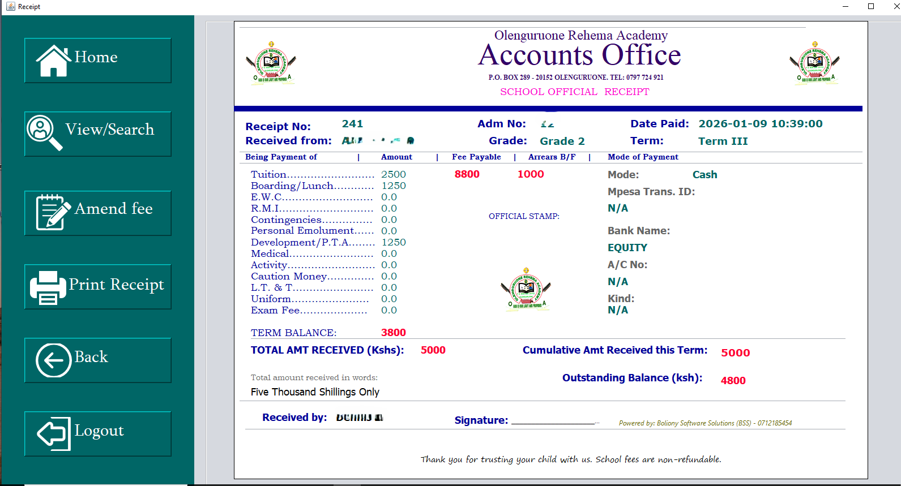
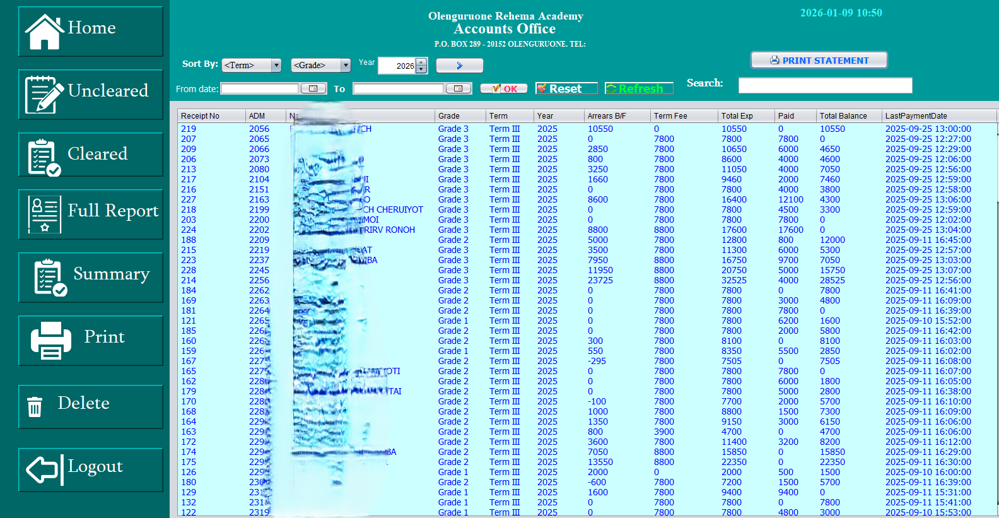
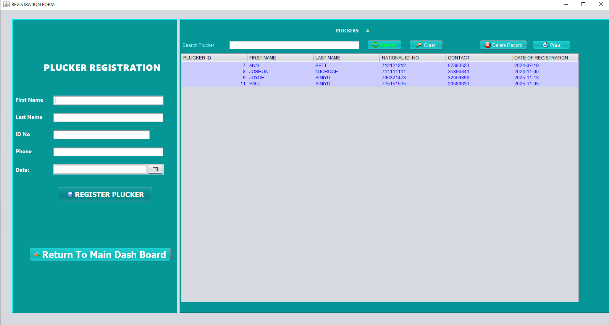
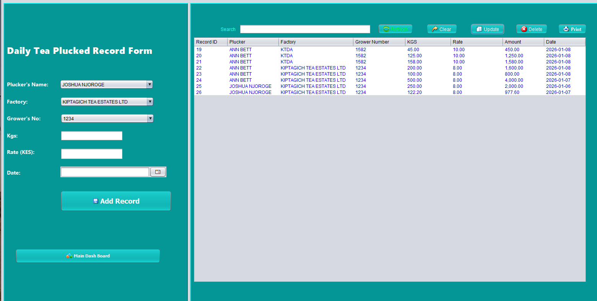
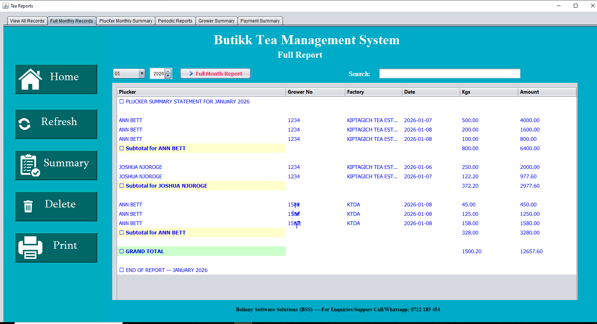

# Joseph Kipkurui Boliony

ICT Expert | Software Developer | Service Support Specialist

## Skills
- Java
- MySQL
- Django
- Python
- IT Support
## Projects
- ScoolApp - School Management System
- Butikk - Tea Collection Management System
## Screenshots
## 1. ScoolApp
### Login Page

### Dashboard

### Fees Module -making payments

### Receipt

### Fee Statements

### Approval Dialog

## Butikk
### Login Page

### Dashboard

### Plucker Registration

### Factory & Grower Registration

### Advance Payments

### EWeight Capture

### Reports

### Factory & Grower Registration

---

## Status
Deployed and operational.

## Contact
Email: joseph.boliony@gmail.com
